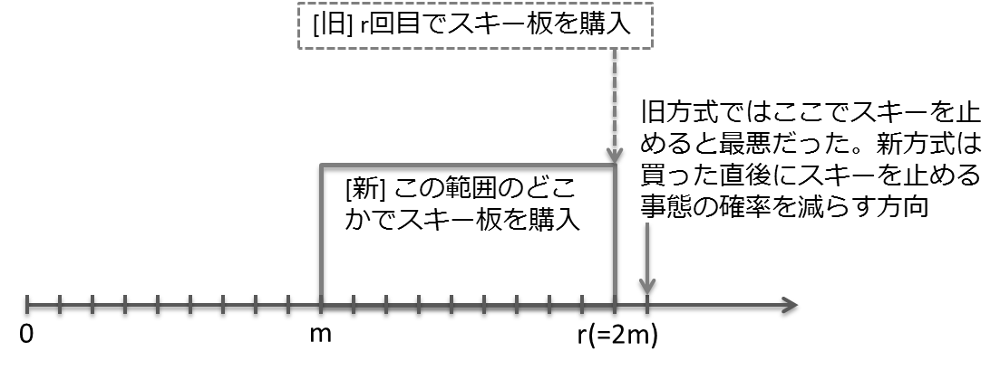

2.4.1 乱択アルゴリズムの設計
-----------------------------------------------------------

レンタルスキー再掲
^^^^^^^^^^^^^^^^^^^^^^^^^^^^^^^^^^^^^^^^^^^^^^^^^^^^^^^^^^^^^
スキー板の値段を :math:`X` , レンタル料を :math:`Y` , :math:`r=X/Y` とする。

:math:`k` 回目のスキーのときに、スキー板を買ったとして、買えばよかった、となる後悔度合い。

.. math::

	 \frac{(k-1)Y + X}{X}

:math:`k` 回目のスキーのときに、スキー板を買ったとして、レンタルしておけばよかった、となる後悔度合い。

.. math::

	 \frac{(k-1)Y + X}{kY}

これらが等しいときに競合比は最小となり、その時の :math:`k` の値は

.. math::

	 X &= kY \\
	 k &= r

であり、競合比の値は以下となる。

.. math::
	 \frac{(k-1) + X/Y}{X/Y} &= \frac{r-1+r}{r} \\
	 &= \frac{2r - 1}{r} = 2 - r^{-1}

乱択レンタルスキー
^^^^^^^^^^^^^^^^^^^^^^^^^^^^^^^^^^^^^^^^^^^^^^^^^^^^^^^^^^^^^^^^
* 以前の例では :math:`r=X/Y` の時に購入する戦略
* 今回は、適当な回数行ったところでスキーを買う。その戦略としては :math:`m+1` 回目から :math:`r` 回目の間で、スキー板を買う日をランダムに確率 :math:`1/(r-m) = 2/r` で決めて、その日に購入する。

..
  * :math:`r=2m` と置いた意味は?
    * 決定的アルゴリズム(?)に従った場合に、競合比を最小にするスキー板を買う日（回目）が :math:`r` である。
    * :math:`r = 2m` は、スキー購入日の選択範囲を、その決定的アルゴリズムの場合に競合比最小とするスキー購入日（回目）以下、かつその半分よりも大きな日とすること。
    * だから?

期待値
"""""""""""""""""""""""""""""""""""""""""""""""""""""""""""""""""""""
* 費用の期待値を考える。
* 合計 :math:`s` 回行くことになったとする。
*  :math:`m \leq r` の時に、最適オフラインアルゴリズムに従うと費用は :math:`sY` である。

:math:`s \leq m` の時には :math:`m < s \leq r` の時を考える。 :math:`i` が選ばれる確率は :math:`1/(r-m)=2/r` . そしてスキー板購入金額の期待値は

.. math::
   E_{\rm buy} &= \sum_{i = m + 1}^{s} X \frac{2}{r} \\
   &= \frac{2 (s - m) X}{r} \\
   &= (2s - r)Y

である。一方レンタルに使用する金額は :math:`i` 回目に購入するとすれば :math:`(i-1)Y` かかり、最終回までに購入しない場合は :math:`sY` かかる。その期待値は

.. math::
   E_{\rm rent} &= \sum_{i = m + 1}^{s} \frac{2}{r} (i - 1) Y + \frac{2}{r} (r - s)sY \\
   &= \frac{2}{r}\left(m + (m+1) + \cdots + (s - 1)\right)Y + \frac{2}{r}(r - s) sY \\
	 &= \frac{2}{r} \left( \frac{(s-1+m)(s-1-m)}{2} + \frac{s-1+m}{2} \right) + \frac{2}{r}(rs - s^2)Y \\
   &= \frac{1}{r}\left( -s^2 - s - m^2 + m + 2rs - 2s^2 \right)Y \\
   &= \frac{1}{r}\left( -s^2 - r^2/4 + 2rs - (s - m) \right) Y \\
   &= \frac{\left(-4s^2 + 8rs - r^2 - (s - m)\right)Y}{4r} \\
	 &\leq \frac{\left(-4s^2 + 8rs - r^2\right)Y}{4r} \qquad(\because (s - m) > 0)

である。以上から競合比は

.. math::
   \frac{(E_{\rm buy} + E_{\rm rent})}{sY} &= \left( (2s - r)Y + \frac{\left(-4s^2 + 8rs - r^2\right)Y}{4r} \right) / sY \\
   &= 2 - \frac{r}{s} - \frac{s}{r} + 2 - \frac{r}{4s} \\
	 &= 4 - \frac{5r}{4s} - \frac{s}{r} 

となる。 :math:`r=s` のときに最小であり（要確認）、そのときの値は7/4となり、以前の方式の2から7/4に減少させることができた。

演習問題 2.8
""""""""""""""""""""""""""""""""""""""""""""""""""""""""""""""""""""
乱択範囲を初回からにするということ? ( :math:`m = 0` )

